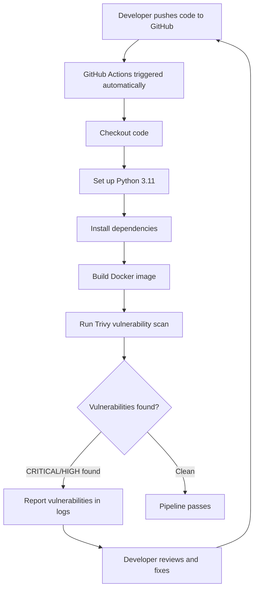

# DevSecOps Secure CI/CD Pipeline with Security Scanning

<div align="center">


[](https://github.com)
[](https://github.com)
[](https://github.com)

**Author:** Madhukar Pendalwar &nbsp;|&nbsp; **Platform:** GitHub Actions + Docker &nbsp;|&nbsp; **Level:** Intermediate

</div>

---

## Project Overview

> **An automated DevSecOps CI/CD pipeline that integrates security scanning directly into the development workflow.**

This project demonstrates how security can be "shifted left" — meaning security checks happen automatically at every code push, before deployment. Every time code is pushed to GitHub, the pipeline automatically builds a Docker image and runs Trivy vulnerability scanning to detect security issues early.

### Key Concept — What is DevSecOps?

Traditional approach: Develop → Deploy → Security check (too late!)

DevSecOps approach: Develop → **Security check automatically** → Deploy (security built-in!)

---

## Technologies Used

| Category | Technology | Purpose |
|----------|-----------|---------|
| CI/CD | GitHub Actions | Automated pipeline trigger on code push |
| Containerization | Docker | Build and package the application |
| Security Scanning | Trivy (Aqua Security) | Vulnerability detection in Docker images |
| Web Framework | Flask (Python) | Simple web application |
| Language | Python 3.11 | Application runtime |

---

## Pipeline Architecture



---

## Project Structure

```
devsecops-secure-pipeline/
│
├── app.py                          # Flask web application
├── requirements.txt                # Python dependencies
├── Dockerfile                      # Container build instructions
├── .github/
│   └── workflows/
│       └── security-pipeline.yml   # GitHub Actions CI/CD pipeline
└── README.md
```

---

## Application Code

### app.py — Flask Web Application

```python
from flask import Flask

app = Flask(__name__)

@app.route('/')
def home():
    return '''
    <h1>DevSecOps Pipeline</h1>
    <p>Developed by Madhukar Pendalwar</p>
    <p>Secured with GitHub Actions + Trivy + Docker</p>
    '''

@app.route('/health')
def health():
    return {'status': 'healthy', 'app': 'devsecops-pipeline'}

if __name__ == '__main__':
    app.run(host='0.0.0.0', port=5000)
```

### Dockerfile

```dockerfile
FROM python:3.11-slim

WORKDIR /app

COPY requirements.txt .
RUN pip install --no-cache-dir -r requirements.txt

COPY app.py .

EXPOSE 5000

CMD ["python", "app.py"]
```

---

## GitHub Actions Pipeline

```yaml
name: DevSecOps Security Pipeline

on:
  push:
    branches: [ main ]
  pull_request:
    branches: [ main ]

jobs:
  security-scan:
    name: Security Scanning
    runs-on: ubuntu-latest

    steps:
      - name: Checkout code
        uses: actions/checkout@v3

      - name: Set up Python
        uses: actions/setup-python@v4
        with:
          python-version: '3.11'

      - name: Install dependencies
        run: pip install -r requirements.txt

      - name: Build Docker image
        run: docker build -t devsecops-app:latest .

      - name: Run Trivy vulnerability scan
        uses: aquasecurity/trivy-action@master
        with:
          image-ref: 'devsecops-app:latest'
          format: 'table'
          exit-code: '0'
          severity: 'CRITICAL,HIGH'

      - name: Trivy scan summary
        run: |
          echo "Security scan completed!"
          echo "Image: devsecops-app:latest"
```

---

## Security Scanning Results

### Pipeline #1 — Initial Scan

**Werkzeug 2.3.7 vulnerability detected:**

| Library | CVE | Severity | Status |
|---------|-----|----------|--------|
| Werkzeug 2.3.7 | CVE-2024-34069 | HIGH | Found — fix available |
| perl-base | CVE-2026-42496 | CRITICAL | OS-level, no fix yet |
| perl-base | CVE-2026-8376 | CRITICAL | OS-level, no fix yet |
| Total Python vulns | — | — | 4 found |

### Fix Applied

Updated `requirements.txt`:

```
# Before
werkzeug==2.3.7

# After — fixed!
flask==3.0.3
werkzeug==3.0.3
```

### Pipeline #2 — After Fix

| | Before Fix | After Fix |
|--|------------|-----------|
| Werkzeug CVE-2024-34069 | HIGH | Resolved |
| Python vulnerabilities | 4 | 3 |
| Total reduction | — | 1 vulnerability fixed |

**Werkzeug vulnerability successfully eliminated by upgrading from 2.3.7 to 3.0.3.**

### Remaining Vulnerabilities — Explanation

| Library | Reason not fixed |
|---------|-----------------|
| perl-base CRITICAL | Debian OS-level — patch not yet released by Debian |
| ncurses HIGH | OS-level — no fix available upstream |
| libsqlite3 HIGH | OS-level — awaiting Debian patch |
| jaraco.context | setuptools internal dependency — not directly controllable |

> These OS-level vulnerabilities are tracked and documented. They will be resolved when Debian releases patches. This is standard practice in production security operations.

---

## Pipeline Runs

| Run | Trigger | Status | Duration | Result |
|-----|---------|--------|----------|--------|
| #1 | Initial commit | Success | 32s | 15 vulnerabilities found, documented |
| #2 | Werkzeug fix | Success | 31s | Werkzeug CVE resolved, 14 remaining |

---

## What This Project Demonstrates

| Skill | Implementation |
|-------|---------------|
| CI/CD Pipeline | GitHub Actions triggers on every push |
| Container Security | Trivy scans Docker image for vulnerabilities |
| Vulnerability Management | Found, fixed, and re-validated CVE-2024-34069 |
| Security Documentation | All findings documented with CVE references |
| Shift-Left Security | Security integrated into development, not after |
| Dependency Management | Updated vulnerable packages to secure versions |

---

## Key Learning — DevSecOps Concepts

**Shift-Left Security** — Security checks happen at code push time, not after deployment. Problems are caught early when they are cheap to fix.

**Vulnerability Scanning** — Trivy checks the Docker image against a database of known CVEs (Common Vulnerabilities and Exposures).

**CVE** — A unique ID given to each known security vulnerability. Example: CVE-2024-34069 is the ID for the Werkzeug debugger vulnerability.

**Fix Deferred** — Some vulnerabilities have no available patch yet. The correct response is to document them and monitor for updates — exactly what was done here.

---

## Resume Description

> **DevSecOps Secure CI/CD Pipeline** | Personal Security Project
>
> Designed and implemented an automated DevSecOps pipeline using GitHub Actions, Docker, and Trivy security scanner. Configured the pipeline to trigger on every code push, automatically building a Docker image and running Trivy vulnerability scans to detect CRITICAL and HIGH severity CVEs. Identified CVE-2024-34069 (HIGH) in Werkzeug 2.3.7, upgraded to version 3.0.3, and validated the fix via re-scan in Pipeline #2. Documented remaining OS-level vulnerabilities with justification. Demonstrated shift-left security practices and automated vulnerability management in a CI/CD workflow.

---

## Skills Demonstrated

- GitHub Actions CI/CD pipeline design
- Docker containerization
- Trivy container security scanning
- Vulnerability identification and remediation
- CVE analysis and documentation
- Python Flask application development
- DevSecOps shift-left security practices

---

## Future Enhancements

| Enhancement | Description | Priority |
|-------------|-------------|----------|
| Fail pipeline on CRITICAL | Set exit-code: '1' to block deployments with critical CVEs | High |
| SARIF report upload | Upload scan results to GitHub Security tab | High |
| AWS ECR deployment | Push secured image to AWS Elastic Container Registry | Medium |
| Dependabot | Auto-create PRs when dependency updates available | Medium |
| SAST scanning | Add Bandit for Python static code analysis | Low |

---

<div align="center">

**Built by Madhukar Pendalwar**

[](https://github.com/features/actions)
[](https://trivy.dev)
[](https://docker.com)

</div>
